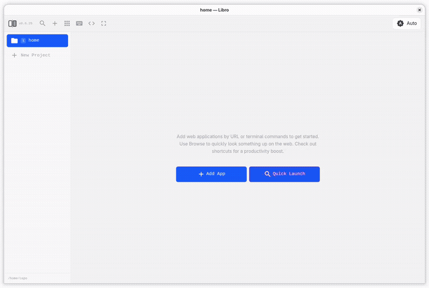

# Libro

A Go + Electron application using [g-sui](https://github.com/michalCapo/g-sui) that manages and displays web applications and terminal sessions in a horizontal strip layout. URL apps render natively via Electron `<webview>` tags, and terminals run via ttyd iframes.

## Demo



## Install

Release downloads are self-contained single binaries. On first launch, Libro extracts its bundled Electron runtime into the user cache directory and starts the desktop app.

[](https://github.com/michalCapo/libro/releases/latest/download/libro-linux-amd64)
[](https://github.com/michalCapo/libro/releases/latest/download/libro-linux-arm64)
[](https://github.com/michalCapo/libro/releases/latest/download/libro-darwin-amd64)
[](https://github.com/michalCapo/libro/releases/latest/download/libro-darwin-arm64)
[](https://github.com/michalCapo/libro/releases/latest/download/libro-windows-amd64.exe)

## Architecture

- **Backend**: Go with g-sui (server-rendered UI via WebSocket)
- **Desktop Shell**: Electron with `<webview>` tag support for native web rendering
- **Frontend**: Minimal client JS for webview lifecycle, navigation tracking, and input forwarding
- **Styling**: Tailwind CSS classes (built into g-sui) with full dark mode support
- **State**: Server-side in-memory (application list, selected index, project snapshots)
- **Persistence**: SQLite database (`~/.local/share/libro/libro.db`)
- **Communication**: WebSocket for UI interactions (g-sui)

## Width System

Each width defines a fixed pixel width:

| Width | Fixed Width |
|-------|-------------|
| SM    | 480px       |
| MD    | 640px       |
| LG    | 960px       |
| XL    | 1280px      |
| 2XL   | 1920px      |
| FULL  | 100%        |

Each app uses its configured fixed pixel width. FULL takes 100% of the viewport.

## Features

Libro is a desktop strip for keeping browser panels and terminal sessions open side by side.

### Core

- Browser apps render in Electron `<webview>`s with a persistent session.
- Terminal apps run through [ttyd](https://github.com/tsl0922/ttyd).
- Apps live in a horizontal strip with fixed widths (`SM` through `FULL`).
- The selected app can be resized, moved left/right, reloaded, or closed.
- Browser panels support navigation, editable URL input, copy URL, reload, and per-panel DevTools.
- Downloads from webviews are saved to the system Downloads folder with in-app progress toasts.

### Search & Launch

- Quick Launch opens a fuzzy search popup for saved apps, URL history, and command history.
- Plain text searches saved entries; `:query` opens a web search; `!command` runs a terminal command.
- Typing a URL or hostname offers a direct `Browse` action.
- A `Browser` entry opens an empty browser panel with the URL bar focused.

### Projects

- Projects are tied to directories, with `home` as the default project.
- Each project keeps its own running strip state while inactive projects stay hidden.
- Saved apps can be global or project-specific.
- Git repositories get worktree actions, and projects/worktrees can be assigned to `Ctrl + 2-9` slots.

### Interface

- App previews appear in the top bar for fast switching.
- Zen mode hides most chrome and leaves the running apps visible.
- The sidebar can be collapsed, and the current app can be toggled to full width.
- The current app version is shown in the header.

### Keyboard Shortcuts

**Apps**

- `⌘ + N` — open launcher on the right
- `⌘ + Ctrl + N` — open launcher on the left
- `⌘ + W` — close current app
- `⌘ + R` — open resize popup
- `⌘ + F` — toggle full width
- `⌘ + +` — zoom in
- `⌘ + -` — zoom out

**Navigation**

- `⌘ + H` — select app to the left
- `⌘ + L` — select app to the right
- `⌘ + Ctrl + U` — move app left
- `⌘ + Ctrl + I` — move app right
- `⌘ + B` — toggle sidebar
- `⌘ + X` — assign or remove current project shortcut
- `Ctrl + 1` — switch to `home`
- `Ctrl + 2–9` — switch to assigned project or worktree
- `Ctrl + 0` — switch to previous project
- `⌘ + G` — open worktree popup
- `⌘ + Z` — toggle zen mode
- `⌘ + Q` — quit Libro

**Browser**

- `Ctrl + L` — open URL/search popup for the selected browser app
- `Ctrl + R` — reload selected browser app
- `/` — find in page
- `n / p` — next / previous find result
- `g / G`, `j / k`, `h / l`, `b / f` — vim-style page navigation
- `y` — copy selected text or current URL
- `c` — open DevTools Console for the selected webview

## Desktop Mode

Libro runs as a desktop application using Electron. The Go backend starts an HTTP/WebSocket server, and Electron opens a `BrowserWindow` pointing to it.

```bash
libro              # starts server + opens Electron window
libro --no-desktop # starts server only (no window)
libro --version    # show version and exit (also -v)
```

The Go binary launches Electron as a child process, passing the server port via `LIBRO_PORT`. When running from the repo, if Electron is not installed locally, Libro runs `npm install` automatically. Release builds embed the Electron app files and a platform-specific Electron runtime, extract them on first launch, and start the desktop UI without any extra files next to the binary. If no desktop runtime is available, Libro falls back to opening the UI in the system browser instead of failing at startup. When the Electron window is closed, the Go process exits.

Electron is configured with `webviewTag: true` for native web rendering. Keyboard shortcuts that would be consumed by webview guest pages are intercepted at the Electron main process level and forwarded to the host page.

### Dependencies

- **Electron** for the desktop shell
- **Node.js / npm** only when running from source or building from the repo
- **g-sui** for server-rendered UI over WebSocket
- **modernc.org/sqlite** for persistence (pure Go, no CGO)

## Key Technical Decisions

1. **Electron webviews over iframes/CDP**: URL apps use Electron `<webview>` tags for native rendering. This eliminates X-Frame-Options/CSP restrictions without the complexity and resource overhead of CDP screencast.
2. **Viewport panning**: CSS `transform: translateX()` on the strip container, controlled by server state. The offset is calculated based on selected app index and total widths.
3. **App container sizing**: Each app container gets a CSS class based on its width setting. Tailwind responsive utilities or inline styles computed server-side.
4. **Session state**: g-sui's WebSocket connection context maintains per-user state. Each connected client has its own `AppState`.
5. **SQLite persistence**: Application definitions and project config are stored in a SQLite database using a pure-Go driver (no CGO dependency). WAL mode enabled for concurrent reads.
6. **Width classes**: Width enum maps to actual CSS max-width values. Uses Tailwind's responsive prefixes (sm:, md:, lg:, xl:, 2xl:).
7. **Keyboard forwarding**: Electron's main process intercepts shortcuts from webview guest pages via `before-input-event` and forwards them as synthetic KeyboardEvents to the host page.
8. **Virtual projects**: Git worktrees create temporary virtual projects that share nav slots with their parent project and are not persisted to the database.
9. **Port allocation**: ttyd ports are allocated starting from 7681, automatically skipping occupied ports.
