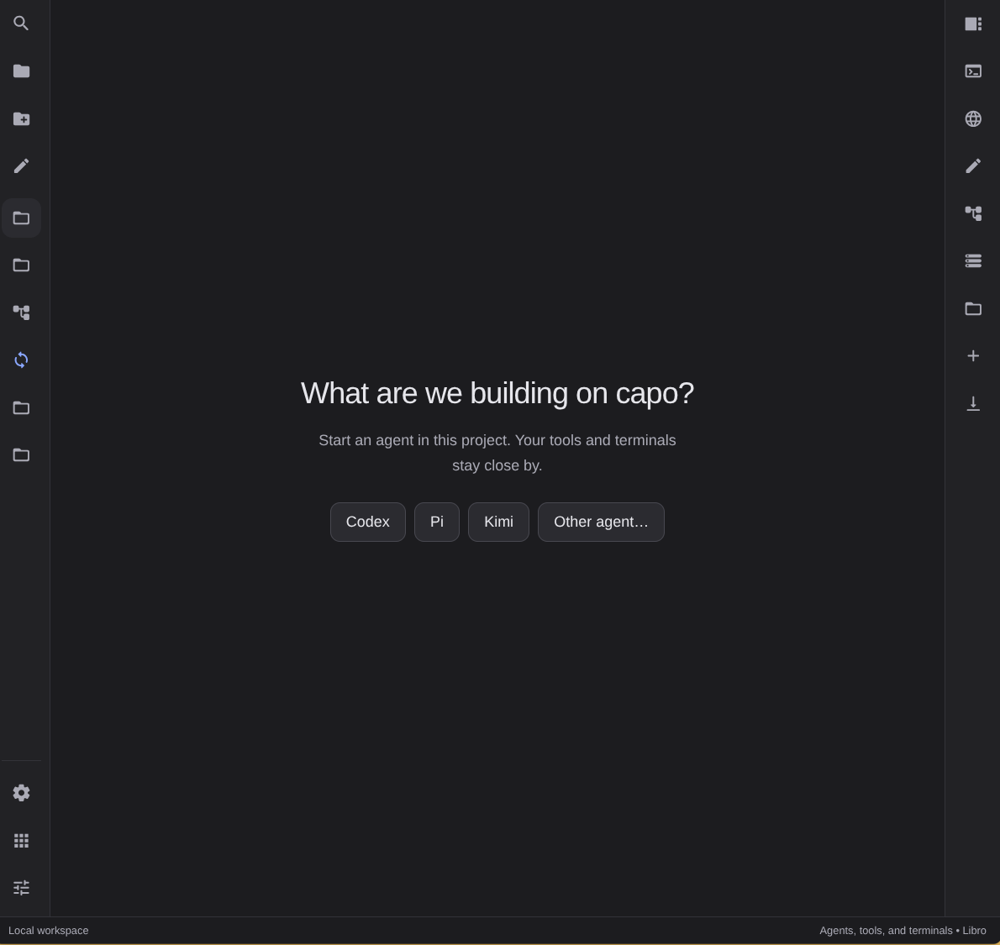
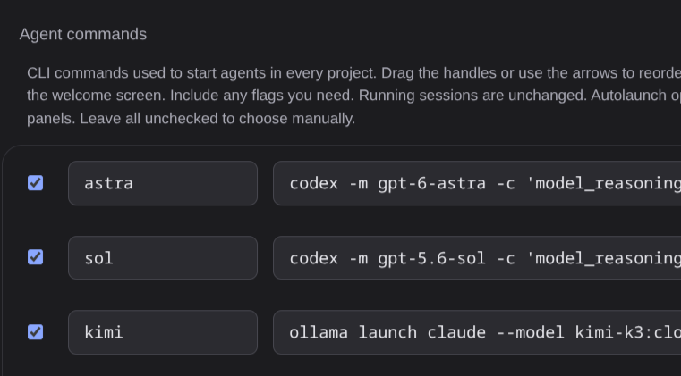
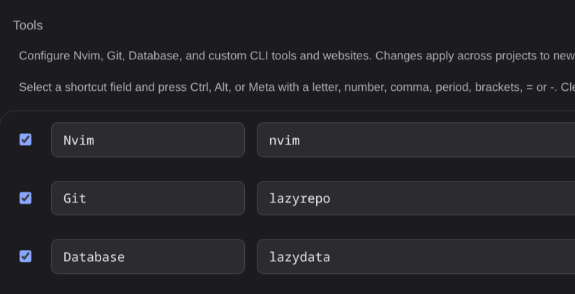
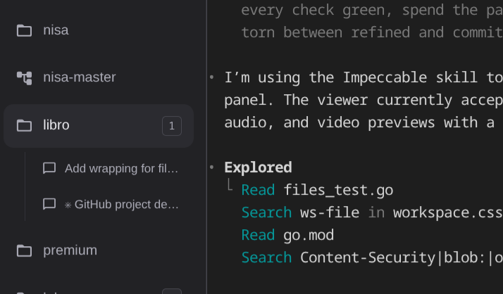
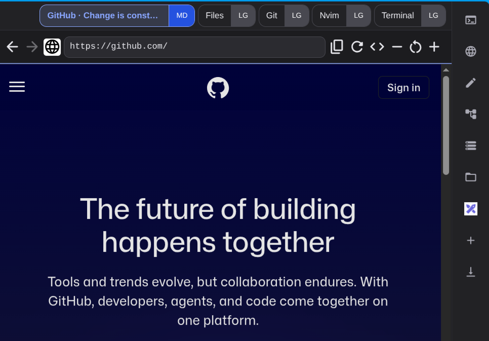
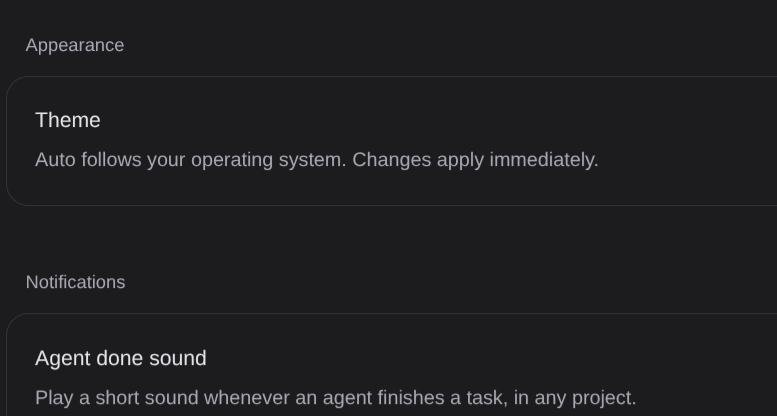

# Libro

Libro is a desktop app for working with AI coding assistants. Run Codex, Claude, Pi, OpenCode, or any other agent in separate threads, with a browser, your files, and terminals right next to each one.

Think of it as one desk for all your AI helpers. Each one gets its own thread and tool state.



## What It Does

- Runs several AI coding assistants at the same time in separate threads.
- Puts a browser, Issues, file manager, terminal, and more right next to them.
- Keeps all your projects in one place. Switch between them with one click.
- Shows when an assistant is busy (its icon spins) or finished (green check).
- Plays a sound when an assistant finishes its work.
- Strong keyboard support — nearly every action has a shortcut.

## Install

1. Download the file for your system below.
2. Run it. Libro sets itself up on first start. Nothing else to install.

[](https://github.com/michalCapo/libro/releases/latest/download/libro-linux-amd64)
[](https://github.com/michalCapo/libro/releases/latest/download/libro-linux-arm64)
[](https://github.com/michalCapo/libro/releases/latest/download/libro-darwin-amd64)
[](https://github.com/michalCapo/libro/releases/latest/download/libro-darwin-arm64)
[](https://github.com/michalCapo/libro/releases/latest/download/libro-windows-amd64.exe)

Works on Linux, macOS, and Windows.

Note: Libro starts the assistants for you, but the assistants themselves (Codex, Claude, Pi, OpenCode) must be installed on your computer first.

### Voice typing

Hold **Tab**, or the microphone beside the agent tab, and speak. Release
to insert the transcript into the selected terminal (or the agent when a browser is selected). Review it and press Enter to send.
Escape, switching threads, or leaving the window cancels dictation. Recordings
are limited to 60 seconds. Change the shortcut in Settings → Shortcuts.

Libro automatically downloads its local speech engine and multilingual Whisper
tiny model on first launch (about 135 MB on Linux x64). `make install` prepares
them during installation. Setup runs in the background and the microphone shows
its status; click it to retry a failed download. Allow microphone access when
your system asks. Once setup finishes, dictation works offline. Audio stays on
your computer and temporary recordings are deleted after transcription.

Voice files are stored in Libro's data directory under `voice/`, shared by its
instances. `libro voice install` can also prepare them ahead of time. The engine
is [sherpa-onnx](https://github.com/k2-fsa/sherpa-onnx), using Whisper tiny with
automatic language detection. No Python, compiler, API key, or GPU is required.

## Development instances

Run `make dev` (or `go run . --dev`) while your installed Libro stays open.
The development instance uses port 8101 and starts with its own empty database,
settings, notes, and browser profile. Its data persists across restarts.
The regular instance keeps port 8100 and its existing data.

For additional instances, choose a unique name and unused port:

```sh
go run . --instance feature-a --port 8102
go run . --dev --no-desktop
```

Named instance data lives under `libro/instances/<name>` in the usual data and
Electron profile directories. Project folders remain shared if you add the same
folder to both instances; edits and commands still affect those files.

Flags must come before commands: `libro --dev application status`.
`LIBRO_INSTANCE` and `LIBRO_PORT` also select an instance and are inherited by
agents and terminals launched inside Libro. An occupied port fails before the
app opens a window or database.

The notes editor is bundled locally into the Go binary. After changing
`internal/note-editor.js`, run `npm ci` and `npm run build:notes`, and include the
updated `internal/note-editor.bundle.js`. `npm run check:notes` checks that the
bundle matches its source. Run the editor integration tests with
`xvfb-run -a node_modules/.bin/electron --no-sandbox --ozone-platform=x11 electron/notes.integration.cjs`.

## Features

### AI assistants

- Each project thread has one agent and its own browser and tool state. Starting another agent creates a new thread under the same project. Issues are shared across that project. Applications can be shared or run separately in each thread. Standalone threads are unchanged.
- Use whatever agent you like. Name it, add its start command, and it shows up next to the built-in ones.


- Choose the width of each panel, from small to full width. Press `Ctrl + M` to make a panel full width and back.
- Hidden panels keep running. Switch away and come back without losing anything.

### Tools

- Open the tool you need next to your assistants: Terminal, Browser, Issues, Files, Nvim, Git, Database, or any tool of your own.
- Use whatever tool you like. Name it, add its command or web address, and it shows up next to the built-in tools.


- The terminal at the bottom runs your project's start command. Start it again with `Ctrl + Shift + R`, stop it with `Ctrl + Shift + T`.
- In Files, press `Backspace` to go up one folder.

### Projects

- A project is a folder on your computer. Add as many as you like.
- Switch projects with `Ctrl + P`, or with `Ctrl + 1` to `Ctrl + 9`.
- Project-backed threads keep the project folder as their working directory.
- Each thread remembers its own browser, files, terminal, and other thread-local tools. Threads in the same project share Issues. Project settings choose a shared application or one application per thread.



### Browser

- Open a browser panel with `Ctrl + B`, or a new separate one with `Ctrl + Shift + B`.
- Browse with the keyboard: `o` opens a page, `r` reloads, `j` and `k` scroll, `i` lets you type in a page, `Esc` goes back.
- Ask the agent about part of a page: press `a` and click an element, or `d` and draw a box around it. Type a short note and it is pasted into the agent, together with that part of the page.



### Issues

- Open Issues with `Ctrl + I`. Issues are stored separately for each project.
- Start with the Open list. Switch the filter to see Archived notes or all notes.
- Edit formatted text in one area using Markdown shortcuts or the formatting toolbar.
- Paste a PNG, JPEG, or GIF screenshot at the cursor, or use Insert image. Images stay in place between paragraphs when saved. Select an image and press Backspace or Delete to remove it.
- Save keeps the editor open. Cancel discards unsaved changes. Send a saved note to the selected agent to execute it, with local paths to any attached images.

### Settings

- Light, dark, or follow your system theme.
- Play a sound when an assistant finishes.
- Set the default panel size for new panels.
- Choose one agent to start on its own when you open a project that has no agents open.
- Choose if browser prompts run right away, or are only pasted in.
- Change how assistants and tools start, rename them, add your own.
- Change any keyboard shortcut and restore the defaults anytime.



## Keyboard Shortcuts

### Agents and projects

| Shortcut | Action |
| --- | --- |
| `Ctrl + N` | New assistant |
| `Ctrl + A` | Jump to the current assistant |
| `Ctrl + P` | Pick a project |
| `Ctrl + 1` – `Ctrl + 9` | Go to a project |
| `Ctrl + Shift + P` | Show or hide the project sidebar |

### Panels and tools

| Shortcut | Action |
| --- | --- |
| `Ctrl + T` | Terminal |
| `Ctrl + B` | Browser |
| `Ctrl + Shift + B` | New browser panel |
| `Ctrl + F` | Files |
| `Ctrl + I` | Issues |
| `Ctrl + E` | Nvim |
| `Ctrl + G` | Git |
| `Ctrl + D` | Database |
| `Ctrl + Q` | Close the selected panel |
| `Ctrl + ,` / `Ctrl + Shift + .` | Bigger / smaller panel |
| `Ctrl + M` | Full width on or off |
| `Ctrl + H` / `Ctrl + L` | Previous / next panel |
| `` Ctrl + ` `` | Bottom terminal |
| `Ctrl + ;` | Search all commands |
| `Ctrl + .` | Settings |
| `Ctrl + =` / `Ctrl + -` / `Ctrl + 0` | Zoom in / out / reset |

Every shortcut can be changed in **Settings → Keyboard shortcuts**.

### Agent tools

New Codex, Claude (including Ollama-launched Claude), and OpenCode sessions
register the `libro` MCP server automatically. It provides `application` and
`issues` tools. Pi receives instructions for the equivalent CLI commands.
Custom agents can register `libro mcp` as a stdio MCP server.
Agents also receive instructions to use the separately installed `agent-browser`
CLI for browser testing, with a unique session per agent/thread. Libro does not
install agent-browser or share its browser panel logins with it.
Restart existing agent sessions to load the updated tools and instructions.

### Finish a project thread

Press **Ctrl+;** for a searchable dialog with the current thread’s actions.
**Close thread** closes its panels and removes its shortcut number, including on
the Base branch. Files, branches, and worktrees stay on disk. Select the project
or worktree again to reopen it.
You can also right-click a worktree thread or open its **⋯** menu, then choose
**Merge thread…**, **Squash thread…**, or **Create draft PR…**. Each opens its
own confirmation dialog. In Ctrl+;, search for “merge” and press Enter to open
Merge thread. The command palette also has **Finish current thread…**, which
opens Merge thread.
You can assign a shortcut in Settings; it opens the review dialog and never
merges immediately.

The dialog shows the destination branch, recent commits, and changed-file
summary. The original branch is preselected. Older worktrees without a recorded
source default to the Base project’s current branch. You can change the destination.

- **Merge** preserves commits. **Merge and remove thread** integrates locally,
  stops the thread's processes, removes the worktree, and returns to Base.
- **Squash** creates one commit with the message you enter, then performs the
  same cleanup.
- **Create draft PR** pushes the reviewed commit to `origin` and creates a draft
  using GitHub CLI (`gh auth login` must already be configured). It keeps the
  thread and worktree open. This requires a GitHub-compatible remote.

Local merges require committed thread changes and a clean destination checked
out in another worktree. If either branch changes after review, the dialog
reloads the preview after reporting the error. Conflicts and failed commits keep the thread open; resolve or abort the
Git operation in the destination worktree before retrying. A failed merge also
offers **Ask the agent to merge**: Enter confirms and Escape cancels. Confirmation
sends the task only to that thread’s running agent. The agent keeps the worktree
open; use Merge again after resolution to finish cleanup. Failed cleanup keeps
the worktree and reports the error. Shared applications are preserved.

Successful local merges and squashes remove the thread, branch, and worktree
automatically. Removing a worktree also removes ignored files in its folder. **Discard thread…** is a
separate menu action: its final button removes the thread, branch, and worktree,
including uncommitted and untracked files, without a typed confirmation.

### Agent application control

Agents can use the `application` tool on the `libro` MCP
server to start, restart, stop, or check the project application. Set the
**Start command** in project settings first. The tool uses the same bottom
terminal as Libro's application shortcuts and leaves agent terminals running.

For agents without MCP:

```sh
libro application status
libro application start
libro application restart
libro application stop
```

In project settings, choose **Application per thread** (the default) or
**Shared application**. Stop existing application terminals before changing
mode. Shared mode runs one process in the original project folder. Per-thread
mode runs each process in its own worktree, inherits the project's start command
unless overridden, and assigns a free port through `PORT`. The command must use
that port, for example:

```sh
npm run dev -- --port "$PORT"
```

Leave **Port for this thread** blank for automatic allocation, or enter a port
from 1 to 65535. Libro rejects occupied ports and ports assigned to another
pending application. Automatic ports remain stable during restart when available.
An arbitrary start command must bind its port itself, so an unrelated process
can still take the port between allocation and startup. The localhost URL appears
in the thread's settings and in application status. Port assignment does not
isolate databases, files, or background jobs.

The application MCP tool accepts only `action`: `status`, `start`, `restart`, or
`stop`. Its workspace is fixed when the MCP server starts. It rejects project,
PID, command, and port arguments. Libro sets `LIBRO_APPLICATION_PATH` for agent
sessions; CLI application calls stay bound to that workspace even if the agent
changes directory, and reject a different explicit project path. Outside agent
sessions, the CLI can take an optional project path after the action.

In per-thread mode, start, stop, and restart affect only the assigned thread's
application. In shared mode they affect the project's shared application.
No lifecycle action changes the visible workspace or touches agent terminals.
`start` preserves a running or starting process; `restart` replaces it. Status
includes `mode`, `port`, and `url` (port 0 and an empty URL when unassigned).
A `starting` response confirms a launch request; `running` does not guarantee
HTTP readiness. Agents must check status first and use the returned URL rather
than starting an unmanaged server. Only the saved command can be run.
Restart existing agent sessions to load the scoped MCP schema and instructions.

### Agent issue management

The `issues` tool on the `libro` MCP server supports:

- `list`: issue summaries, with optional `status`, `limit` (default 100, max 200), and `offset`.
- `read`: the full issue, including Markdown body and saved images, by `id`.
- `create`: requires `title`; accepts `body` and `status`.
- `set_status`: requires `id` and `status`; preserves the description and images.
- `delete`: permanently removes the issue by `id`.

Statuses are `new` (Open) and `archived`. Create defaults to `new`.
Use full issue IDs from `list` or `create`. Read/create results use `state`
for the saved status, matching Libro's issue storage.

The project defaults to the agent's working directory, or accepts an explicit
`project` path. That project must be active in Libro. No Issues or browser
panel needs to be open. This uses the same desktop bridge and enable/pause
controls as application control. Restart existing agent sessions to discover
the new tool. Open issue lists refresh after agent changes; unsaved editor
text is preserved.

CLI fallback:

```sh
libro issues '{"action":"list"}'
libro issues '{"action":"create","title":"Fix login","body":"Steps to reproduce"}'
libro issues '{"action":"read","id":"ISSUE_ID"}'
libro issues '{"action":"set_status","id":"ISSUE_ID","status":"archived"}'
libro issues '{"action":"delete","id":"ISSUE_ID"}'
```

Ctrl+N creates a new thread directly. Ctrl+Shift+A opens Replace agent for the
current thread. Both shortcuts can be changed in Settings.
