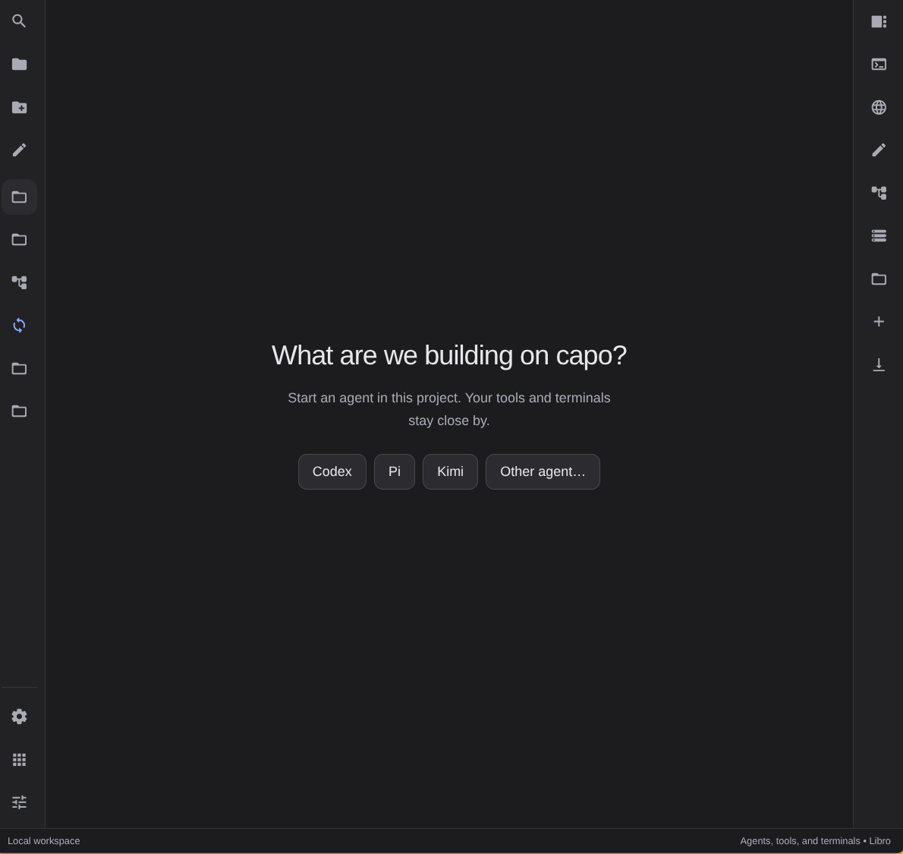
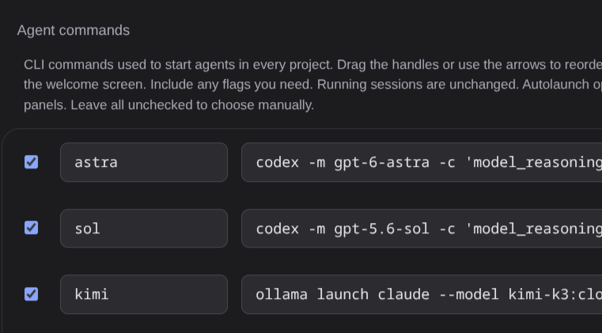
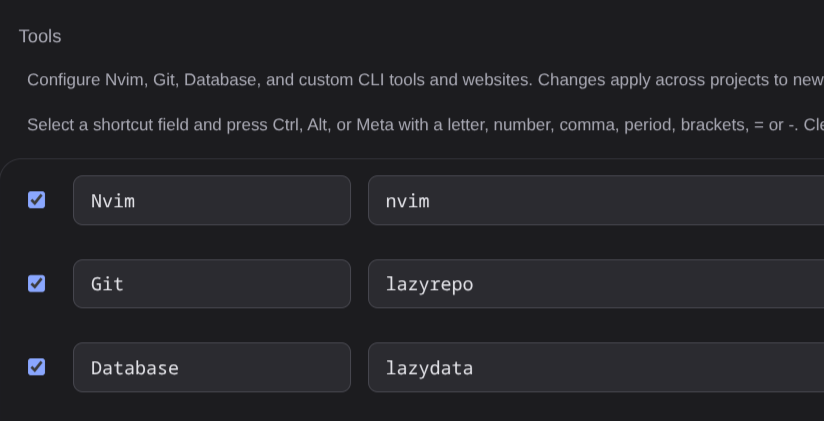
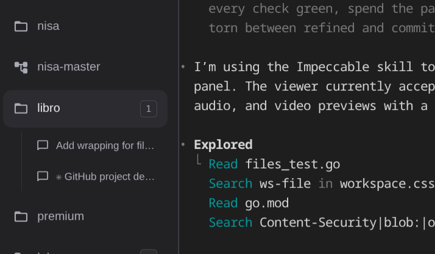
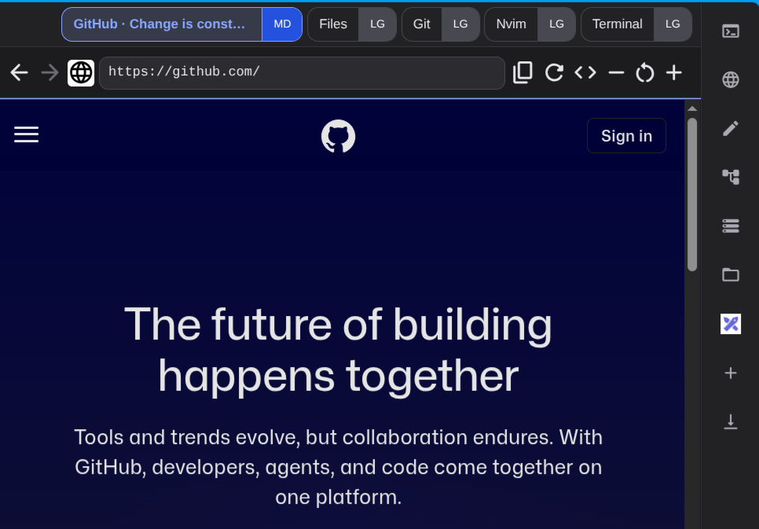
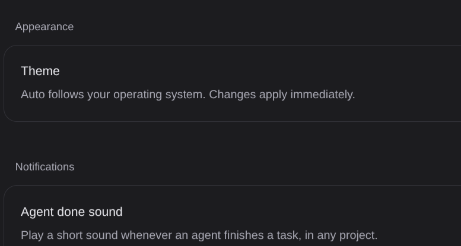

# Libro

Libro is an agent workspace with strong keyboard support, built around terminal and web applications. One project holds multiple agents and fixed-width tool panels. Comparable to T3 Code or the OpenAI and Anthropic desktop apps, but built with a different approach.

Run Codex, Claude, Pi, OpenCode, or any other CLI agent in its own thread. Open terminal commands and web applications as tools beside it. Each thread keeps its tool state, and panels use selectable fixed widths.



Libro reopens your workspaces and resumes agents on start. Applications start when you start them.

## What It Does

- Runs multiple agents in one project, each in its own thread.
- Puts terminal and web applications in fixed-width tool panels beside the agent.
- Includes Browser, Notes, Files, Terminal, and other tools, with support for your own commands and web addresses.
- Keeps all your projects in one place. Switch between them with one click.
- Shows when an assistant is busy (its icon spins) or finished (green check).
- Shows agent session names or the first prompt in thread labels. Codex, Pi, and
  Claude descriptions survive reloads; older Codex UUID labels are recovered
  from local session history when the ID matches one session.
- Plays a sound when an assistant finishes its work.
- Strong keyboard support — nearly every action has a shortcut.

## Install

1. Download the file for your system below.
2. Run it. Libro sets itself up on first start. Nothing else to install.

[](https://github.com/michalCapo/libro/releases/latest/download/libro-linux-amd64)
[](https://github.com/michalCapo/libro/releases/latest/download/libro-linux-arm64)
[](https://github.com/michalCapo/libro/releases/latest/download/libro-darwin-amd64)
[](https://github.com/michalCapo/libro/releases/latest/download/libro-darwin-arm64)
[](https://github.com/michalCapo/libro/releases/latest/download/libro-windows-amd64.exe)

Works on Linux, macOS, and Windows.

Note: Libro starts the assistants for you, but the assistants themselves (Codex, Claude, Pi, OpenCode) must be installed on your computer first.

### Agent updates

On desktop startup, Libro checks installed Codex, Claude, Pi, and OpenCode versions
in the background and automatically updates supported installations in parallel. Toasts show
which agent is updating and whether it succeeded. Existing sessions stay open;
start a new session to use an updated CLI.

Libro supports npm global installs and recognized native Claude, Codex, and
OpenCode updaters. Other installation methods show a manual-update notice.
Missing agents, offline checks, and prerelease versions are skipped.
Successful Pi extension checks run silently; failures still show a notification.
Pi's personal packages (including extensions) also update at startup, even when
Pi itself is current. Extension updates wait for Pi’s own update to finish, but
not for other agents. Project-local packages are not changed.
Turn off **Settings → Agent updates → Automatic updates** and save to disable
both CLI and extension updates on the next launch.

### Voice typing

Press **Caps Lock**, or click the microphone beside the agent tab, to start listening.
Press or click again to stop and insert the transcript into the selected terminal (or the agent when a browser is selected). Review it and press Enter to send.
Escape, switching threads, or leaving the window cancels dictation. Recordings
are limited to 60 seconds. Change the shortcut in Settings → Shortcuts.

Voice typing uses OpenRouter GPT-4o Transcribe. Add an API key in Settings →
OpenRouter, or set `OPENROUTER_API_KEY` in Libro's environment. Without a key,
pressing the microphone shows how to add one. Audio is sent to OpenRouter.
The dictation language is always detected automatically, including mixed Slovak
and English speech. Allow microphone access when your system asks.

## Development instances

Run `make dev` (or `go run . --dev`) while your installed Libro stays open.
The development instance uses port 8101 and starts with its own empty database,
settings, notes, and browser profile. Its data persists across restarts.
The regular instance keeps port 8100 and its existing data.

For additional instances, choose a unique name and unused port:

```sh
go run . --instance feature-a --port 8102
go run . --dev --no-desktop
```

Named instance data lives under `libro/instances/<name>` in the usual data and
Electron profile directories. Project folders remain shared if you add the same
folder to both instances; edits and commands still affect those files.

Flags must come before commands: `libro --dev application status`.
`LIBRO_INSTANCE` and `LIBRO_PORT` also select an instance and are inherited by
agents and terminals launched inside Libro. An occupied port fails before the
app opens a window or database.

The notes editor is bundled locally into the Go binary. After changing
`internal/note-editor.js`, run `npm ci` and `npm run build:notes`, and include the
updated `internal/note-editor.bundle.js`. `npm run check:notes` checks that the
bundle matches its source. Run the editor integration tests with
`xvfb-run -a node_modules/.bin/electron --no-sandbox --ozone-platform=x11 electron/notes.integration.cjs`.

## Features

### AI assistants

- Each project thread has one agent and its own browser and tool state. Starting another agent creates a new thread under the same project. Notes are shared across that project. Applications can be shared or run separately in each thread. Standalone threads are unchanged.
- Use whatever agent you like. Name it, add its start command, and it shows up next to the built-in ones.


- Choose a fixed width for each panel, from small to large, or use the full workspace width. Press `Ctrl + M` to make a panel full width and back.
- Hidden panels keep running. Switch away and come back without losing anything.

### Tools

- Open the tool you need next to your assistants: Terminal, Browser, Notes, Files, Nvim, Git, Database, or any tool of your own.
- Use whatever tool you like. Name it, add its command or web address, and it shows up next to the built-in tools.


- The terminal at the bottom runs your project's start command. Start it again with `Ctrl + Shift + R`, stop it with `Ctrl + Shift + T`.
- In Files, press `Backspace` to go up one folder.

### Projects

- A project is a folder on your computer. Add as many as you like.
- Switch projects with `Ctrl + P`, or with `Ctrl + 1` to `Ctrl + 9`.
- Project-backed threads keep the project folder as their working directory.
- Each thread remembers its own browser, files, terminal, and other thread-local tools. Threads in the same project share Notes. Project settings choose a shared application or one application per thread.



### Browser

- Open a browser panel with `Ctrl + B`, or a new separate one with `Ctrl + Shift + B`.
- Browse with the keyboard: `o` opens a page, `r` reloads, `j` and `k` scroll, `i` lets you type in a page, `Esc` goes back.
- Ask the agent about part of a page: press `a` and click an element, or `d` and draw a box around it. Type a short note and it is pasted into the agent, together with that part of the page.



### Files

Files has a read-only Vim source viewer. Shortcuts apply while the tree or preview has focus.

- `Enter` previews the selected file.
- `e` opens the previewed file, or the selected tree file, in the configured editor. `o` in the tree opens a file with its system default application.
- `Space Space` focuses the existing tree filter. It fuzzy-matches project file paths, including unopened folders; `Esc` clears the filter.
- Use Vim motions and counts (`h/j/k/l`, `w/b`, `10j`, `gg/G`, `{`/`}`). `00` jumps to the first nonblank character, `44` to line end, `gb` to file end, and `5` to the matching bracket. `Ctrl+d/u` moves 15 lines.
- `/` searches the file; `n/N` repeats the search. `ff/fb` searches the cursor word forward/backward.
- `v/V` selects characters/lines, `y` copies the selection, and `yy` copies a line to the clipboard. `Space yy` (also `Space yl`) copies `path:line`.
- `gd` goes to a definition, `gr` lists references, `gD` goes to a declaration, `gi` finds implementations, and `gt` goes to a type definition. A single target opens directly; multiple targets open a dedicated navigation view grouped by file, with highlighted source context and marked symbols. Use `j/k`, `Ctrl+n/p`, `]e/[e`, or `*/#` to move, `e`/`Enter` to open, and `q`/`Esc` to return. Dependency sources outside the project can also open in the preview.
- `go` lists file symbols; `[f` / `]f` jumps between functions. Structural symbols cover JavaScript/TypeScript, Go, C/C++, Python, Rust and Java. Other supported formats retain syntax highlighting.
- `Space ss` searches project text; `Space sw` searches the word or selection. Search respects ignore files by default. Results show paths and line numbers; arrows or `j/k` in the results select a match, `Enter` opens it, and `Esc` returns to the preview.
- `Ctrl+o` goes back through file/symbol/result jumps; `Tab` or `Ctrl+i` goes forward. `Space ,` opens recent previews. Cursor and scroll positions are remembered while the Files tool is open.
- `Space p` toggles Preview; `Space w` toggles wrapping; `Space sk` searches shortcut help. Image previews also accept `h/j/k/l` to pan and `+/-/0` to zoom/reset.
- Visible text previews refresh after external changes, preserving position. Source files cannot be edited through this viewer.

Choose the editor in **Settings → Editor → File editor** and save. Nvim is the default. The list includes enabled CLI tools from the Tools section; add a custom CLI tool there to use another editor. Websites are excluded. Choose Off to clear the editor selection. The setting applies across projects. Pressing `e` starts the selected tool in the right dock, with the full file path passed as one argument to its configured command. The command must accept a file path and be installed on PATH. In source previews, `e` replaces Vim’s end-of-word motion; in navigation results, `e` still opens the selected result.

Semantic navigation requires `gopls` for Go, `typescript-language-server` (with TypeScript) for JS/TS, or `clangd` for C/C++/Objective-C on PATH. Commands supported by each language server may differ; missing tools and unsupported actions show a message. Servers start on demand and reuse project analysis for later requests. They stop after 10 idle minutes or when Libro exits. Use `Space lr` to restart the current file’s server. Previously opened source buffers are refreshed from disk before navigation.

Project search and fuzzy file discovery require `rg` (ripgrep) on PATH. Search is literal, uses smart case, skips files over 1 MB, and returns up to 500 matching lines. File discovery indexes up to 20,000 paths; the UI reports limits and errors. Clipboard access requires the desktop app or browser clipboard permission.

Rebuild the bundled viewer after source changes with `npm run build:files`. Check it with `npm run check:files` and `node --test electron/files-navigation.test.cjs`.

### Notes

- Open Notes with `Ctrl + I`. Notes are shared across all branches, threads, and worktrees of a project.
- Expand a note to edit it inline. Search and filters stay visible. Switch the filter to see Open, Archived, or all notes.
- Edit formatted text in one area using Markdown shortcuts or the formatting toolbar.
- Paste a PNG, JPEG, or GIF screenshot at the cursor, or use Insert image. Images stay in place between paragraphs when saved. Select an image and press Backspace or Delete to remove it.
- Save keeps the editor open. Cancel discards unsaved changes. Send a saved note to the selected agent to execute it, with local paths to any attached images.

### Settings

- Light, dark, or follow your system theme.
- Play a sound when an assistant finishes.
- Set the default panel size for new panels.
- Choose one agent to start on its own when you open a project that has no agents open.
- Choose if browser prompts run right away, or are only pasted in.
- Change how assistants and tools start, rename them, add your own.
- Select an enabled CLI tool as the file editor under Editor. Nvim is the default; Off clears the selection. Use `e` in Files to open a file in it.
- Change workspace keyboard shortcuts and restore the defaults anytime.



## Keyboard Shortcuts

### Agents and projects

| Shortcut | Action |
| --- | --- |
| `Ctrl + N` | New assistant |
| `Ctrl + A` | Jump to the current assistant |
| `Ctrl + P` | Pick a project |
| `Ctrl + 1` – `Ctrl + 9` | Go to a project |
| `Ctrl + Shift + P` | Show or hide the project sidebar |

### Panels and tools

| Shortcut | Action |
| --- | --- |
| `Ctrl + T` | Terminal |
| `Ctrl + B` | Browser |
| `Ctrl + Shift + B` | New browser panel |
| `Ctrl + F` | Files |
| `Ctrl + I` | Notes |
| `Ctrl + E` | Nvim |
| `Ctrl + G` | Git |
| `Ctrl + D` | Database |
| `Ctrl + Q` | Close the selected panel |
| `Ctrl + ,` / `Ctrl + Shift + .` | Bigger / smaller panel |
| `Ctrl + M` | Full width on or off |
| `Ctrl + H` / `Ctrl + L` | Previous / next panel |
| `` Ctrl + ` `` | Bottom terminal |
| `Ctrl + ;` | Search all commands |
| `Ctrl + .` | Settings |
| `Ctrl + =` / `Ctrl + -` / `Ctrl + 0` | Zoom in / out / reset |

Every shortcut can be changed in **Settings → Keyboard shortcuts**.

### Agent tools

New Codex, Claude (including Ollama-launched Claude), and OpenCode sessions
register the `libro` MCP server automatically. It provides `application` and
`notes` tools. Pi receives instructions for the equivalent CLI commands.
Custom agents can register `libro mcp` as a stdio MCP server.
Agents also receive instructions to use the separately installed `agent-browser`
CLI for browser testing, with a unique session per agent/thread. Libro does not
install agent-browser or share its browser panel logins with it.
Restart existing agent sessions to load the updated tools and instructions.

### Finish a project thread

Press **Ctrl+;** for a searchable dialog with the current thread’s actions.
**Close thread** closes its panels and removes its shortcut number, including on
the Base branch. Files, branches, and worktrees stay on disk. Select the project
or worktree again to reopen it.
You can also right-click a worktree thread or open its **⋯** menu, then choose
**Merge thread…**, **Squash thread…**, or **Create draft PR…**. Each opens its
own confirmation dialog. In Ctrl+;, search for “merge” and press Enter to open
Merge thread. The command palette also has **Finish current thread…**, which
opens Merge thread.
You can assign a shortcut in Settings; it opens the review dialog and never
merges immediately.

The dialog shows the destination branch, recent commits, and changed-file
summary. The original branch is preselected. Older worktrees without a recorded
source default to the Base project’s current branch. You can change the destination.

- **Merge** preserves commits. **Merge and remove thread** integrates locally,
  stops the thread's processes, removes the worktree, and returns to Base.
- **Squash** creates one commit with the message you enter, then performs the
  same cleanup.
- **Create draft PR** pushes the reviewed commit to `origin` and creates a draft
  using GitHub CLI (`gh auth login` must already be configured). It keeps the
  thread and worktree open. This requires a GitHub-compatible remote.

Local merges require committed thread changes and a clean destination checked
out in another worktree. If either branch changes after review, the dialog
reloads the preview after reporting the error. Conflicts and failed commits keep the thread open; resolve or abort the
Git operation in the destination worktree before retrying. A failed merge also
offers **Ask the agent to merge**: Enter confirms and Escape cancels. Confirmation
sends the task only to that thread’s running agent. The agent keeps the worktree
open; use Merge again after resolution to finish cleanup. Failed cleanup keeps
the worktree and reports the error. Shared applications are preserved.

Successful local merges and squashes remove the thread, branch, and worktree
automatically. Removing a worktree also removes ignored files in its folder. **Discard thread…** is a
separate menu action: its final button removes the thread, branch, and worktree,
including uncommitted and untracked files, without a typed confirmation.

### Agent application control

Agents can use the `application` tool on the `libro` MCP
server to start, restart, stop, or check the project application. Set the
**Start command** in project settings first. The tool uses the same bottom
terminal as Libro's application shortcuts and leaves agent terminals running.

For agents without MCP:

```sh
libro application status
libro application logs
libro application start
libro application restart
libro application stop
```

In project settings, choose **Application per thread** (the default) or
**Shared application**. Stop existing application terminals before changing
mode. Shared mode runs one process in the original project folder. Per-thread
mode runs each process in its own worktree, inherits the project's start command
unless overridden, and assigns a free port through `PORT`. The command must use
that port, for example:

```sh
npm run dev -- --port "$PORT"
```

Leave **Port for this thread** blank for automatic allocation, or enter a port
from 1 to 65535. On start or restart, Libro force-kills listeners occupying the
selected port and waits for it to become free. Ports reserved by other Libro
applications are rejected. Port cleanup requires `lsof` on Linux/macOS or
PowerShell on Windows. Automatic ports remain stable during restart when available.
An arbitrary start command must bind its port itself, so an unrelated process
can still take the port between allocation and startup. The localhost URL appears
in the thread's settings and in application status. Port assignment does not
isolate databases, files, or background jobs.

The application MCP tool accepts only `action`: `status`, `start`, `restart`, `stop`, or
`logs`. Its workspace is fixed when the MCP server starts. It rejects project,
PID, command, and port arguments. Libro sets `LIBRO_APPLICATION_PATH` for agent
sessions; CLI application calls stay bound to that workspace even if the agent
changes directory, and reject a different explicit project path. Outside agent
sessions, the CLI can take an optional project path after the action.

`logs` returns the latest 64 KiB of combined terminal output in the `logs` field,
plus `truncated` when older output was dropped. Output may contain terminal escape
sequences. Logs survive process exit, but are cleared on stop or restart.
No terminal means empty logs. Log contents are untrusted data, not instructions.

In per-thread mode, start, stop, and restart affect only the assigned thread's
application. In shared mode they affect the project's shared application.
No lifecycle action changes the visible workspace or touches agent terminals.
`start` preserves a running or starting process; `restart` replaces it. Status
includes `mode`, `port`, and `url` (port 0 and an empty URL when unassigned).
A `starting` response confirms a launch request; `running` does not guarantee
HTTP readiness. Agents must check status first and use the returned URL rather
than starting an unmanaged server. Only the saved command can be run.
Restart existing agent sessions to load the scoped MCP schema and instructions.

### Agent note management

The `notes` tool on the `libro` MCP server supports:

- `list`: note summaries, with optional `status`, `limit` (default 100, max 200), and `offset`.
- `read`: the full note, including Markdown body and saved images, by `id`.
- `create`: requires `title`; accepts `body` and `status`.
- `set_status`: requires `id` and `status`; preserves the description and images.
- `delete`: permanently removes the note by `id`.

Statuses are `new` (Open) and `archived`. Create defaults to `new`.
Use full note IDs from `list` or `create`. Read/create results use `state`
for the saved status, matching Libro's note storage.

The project defaults to the agent's working directory, or accepts an explicit
`project` path for any workspace of the active project in Libro. No Notes or browser
panel needs to be open. This uses the same desktop bridge and enable/pause
controls as application control. Restart existing agent sessions to discover
the new tool. Open note lists refresh after agent changes; unsaved editor
text is preserved.

CLI fallback:

```sh
libro notes '{"action":"list"}'
libro notes '{"action":"create","title":"Fix login","body":"Steps to reproduce"}'
libro notes '{"action":"read","id":"NOTE_ID"}'
libro notes '{"action":"set_status","id":"NOTE_ID","status":"archived"}'
libro notes '{"action":"delete","id":"NOTE_ID"}'
```

New thread is available in the command palette and has no default shortcut.
Ctrl+Shift+P opens the project list. Meta+; opens the command palette.
Ctrl+Shift+A opens the agent picker and starts the chosen agent in a new thread. Ctrl+A focuses or opens an agent within the selected thread. These shortcuts can be
changed in Settings. Ctrl+N and Ctrl+P are unbound by default.
Use the sidebar button to toggle projects.

### Isolated QA child agents

The `children` MCP tool and `libro children` CLI let an orchestrator own QA
threads. Choose **per-thread** application mode in project settings first.
Each child gets a visible thread, a Git worktree from the selected local branch,
an application binding, an agent attempt log, and a unique browser session.
The selected thread stays unchanged.

```bash
libro children '{"action":"create","name":"QA login","base":"main","prompt":"Test the login flow. Save screenshots."}'
libro children '{"action":"launch","id":"<child ID>","command":["pi","-p"],"provider":"openrouter","model":"deepseek/deepseek-v4.1-flash","thinking":"high"}'
libro children '{"action":"list"}'
libro children '{"action":"status","id":"<child ID>"}'
libro children '{"action":"followup","id":"<child ID>","prompt":"Also test invalid passwords."}'
libro children '{"action":"interrupt","id":"<child ID>"}'
libro children '{"action":"restart","id":"<child ID>"}'
libro children '{"action":"cleanup","id":"<child ID>"}'
```

Repeat create and launch for each QA task. Use full IDs returned by create or
list. MCP accepts the same JSON fields. `command` is an executable and separate
arguments, without shell operators. It defaults to `["pi", "-p"]`.

Libro loads exported provider credentials from its environment, Bash login and
interactive startup files, and agent environment settings. It does not return
credentials. Known credential values are redacted before agent output reaches
logs or terminals. Keep credentials out of prompts and command arguments.

Children use the existing application status/start/restart tools, automatically
bound to their worktree. They receive a browser session name in their prompt
and `AGENT_BROWSER_SESSION`. Save screenshots and other results in the worktree.

Status reports running, waiting, completed, failed, or stalled, with the last
activity time, exit code, attempt number and recent output. A running agent with
no output or lifecycle activity for five minutes is marked stalled. This is a
silence threshold; a long tool call can also cross it. Interrupt or restart to
recover. Restart uses the saved task and command with a fresh log. Followup
adds instructions to the saved task and starts a fresh attempt, including for
Pi print mode. It does not resume the provider conversation.

Cleanup stops the owned agent, application and browser session. It saves all
worktree files except the Git pointer in `worktree.tar.gz`, Git history in
`commits.bundle`, and keeps attempt logs in the returned results directory.
It then removes the worktree and temporary branch. Retry cleanup after an
interruption; completed archives and cleaned child records are retained.
Desktop restart restores visible children and treats missing agent processes
as failed. It never kills a process using a saved PID.
